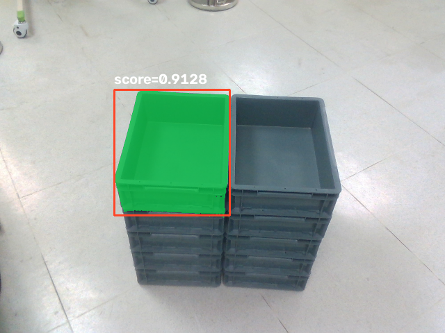
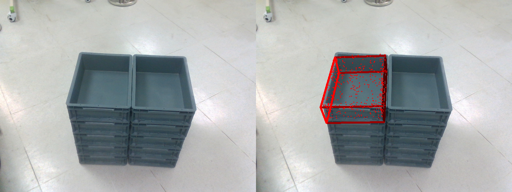
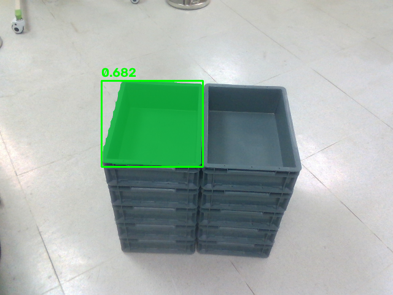

# SAM-6D ROS 2 OpenVINO Integration

ROS 2 service for estimating the 6D pose of a known object from aligned RGB and
depth images. The service uses the current OpenVINO SAM-6D implementation from
`openvino_contrib` and supports two inference modes:

- `command_id: 1`: YOLO -> OpenVINO SAM2 `sam2_hiera_small` -> OpenVINO PEM
- `command_id: 2`: OpenVINO ISM with FastSAM -> OpenVINO PEM

The integration has been validated with ROS 2 Jazzy, OpenVINO 2026.3, an Intel
GPU, and replayed RealSense bag data.

## Architecture

ROS 2 Jazzy uses Python 3.12, while the validated `ov_sam6d` Conda environment
uses Python 3.11. Native Python modules from these environments cannot be loaded
in one process. The integration therefore uses two processes:

1. `pose_estimation_v2.py` runs with ROS 2 and system Python 3.12. It receives
   RGB, aligned depth, and `CameraInfo` messages and exposes the ROS service.
2. `sam6d_worker.py` runs with the Python interpreter from `ov_sam6d`. It runs
   the OpenVINO models and writes the inference artifacts.

The camera matrix is read from the aligned `CameraInfo` topic. For a `16UC1`
depth image, depth values are interpreted as millimeters and written to the
SAM-6D camera file with `depth_scale: 1.0`.

## Path Configuration

Paths depend on the local installation. The paths used during validation were
machine-specific and are intentionally not assumed below. Define these shell
variables for your environment before running the commands in this guide:

```bash
export REPO_ROOT="<path-to-sam_6d_ros-ov>"
export WS_ROOT="<path-to-ros-workspace>"
export OV_SAM6D_ROOT="<path-to-openvino_contrib>/modules/3d/OV-SAM-6D"
export SAM6D_ROOT="$OV_SAM6D_ROOT/SAM-6D"
export OPENVINO_ROOT="<path-to-openvino-runtime>"
export CONDA_ROOT="<path-to-conda-installation>"
export INFERENCE_PYTHON="<path-to-ov_sam6d-environment>/bin/python"
export CAD_PATH="<path-to-object-cad.ply>"
export TEMPLATES_DIR="<path-to-rendered-templates>"
export DETECTOR_DIR="<path-to-yolo-openvino-ir-directory>"
export BAG_PATH="<path-to-rosbag>"
export OUTPUT_DIR="$WS_ROOT/validation"
```

For reference, the validated local machine used the following paths. These are
examples only; use the placeholders above for a different installation:

```bash
export REPO_ROOT="/home/intel/yy/sam_6d_ros-ov"
export WS_ROOT="/home/intel/yy/ws_sam6d_ov"
export OV_SAM6D_ROOT="/home/intel/yy/openvino_contrib/modules/3d/OV-SAM-6D"
export SAM6D_ROOT="$OV_SAM6D_ROOT/SAM-6D"
export OPENVINO_ROOT="/home/intel/yy/openvino_toolkit_ubuntu24_2026.3.0.22451.bd8d6542e3c_x86_64"
export CONDA_ROOT="/home/intel/miniforge3"
export INFERENCE_PYTHON="$CONDA_ROOT/envs/ov_sam6d/bin/python"
export CAD_PATH="/home/intel/yy/logistics-box.ply"
export TEMPLATES_DIR="/home/intel/yy/templates"
export DETECTOR_DIR="/home/intel/yy/det"
export BAG_PATH="/home/intel/yy/rosbag2_2025_09_26-09_52_50"
export OUTPUT_DIR="$WS_ROOT/validation"
```

In this example, `<path-to-sam_6d_ros-ov>` means
`/home/intel/yy/sam_6d_ros-ov`, `<path-to-conda-installation>` means
`/home/intel/miniforge3`, and the other placeholders map to the corresponding
values in the example block.

Replace every angle-bracket placeholder with an absolute path. These variables
apply to the current shell only, so define them in each new terminal or place
the exports in a local environment script. Also edit
`sam_6d_ros/sam_6d_ros/params.yaml` to use the corresponding absolute paths;
ROS parameter files do not expand these shell variables.

## Prerequisites

- Ubuntu 24.04
- ROS 2 Jazzy installed under `/opt/ros/jazzy`
- `colcon` and standard ROS 2 build tools
- Intel GPU drivers
- Miniforge or Conda
- The `ov_sam6d` environment described by the OpenVINO SAM-6D guide
- The OpenVINO 2026.3 runtime package
- A prepared OpenVINO SAM-6D source tree with exported ISM and PEM models
- A CAD model in millimeters and its 42 rendered template views
- A single-class YOLO OpenVINO model with input shape `[1,3,640,640]`

## Set Up OpenVINO SAM-6D Dependencies

This ROS package does not install SAM-6D or its Python inference dependencies.
Prepare `openvino_contrib/modules/3d/OV-SAM-6D` and the `ov_sam6d` Conda
environment before building the ROS workspace.

The `OV-SAM-6D` directory initially contains the OpenVINO port and patches, but
not the complete upstream SAM-6D source tree. Reconstruct it once from the
pinned upstream revision:

```bash
cd "$OV_SAM6D_ROOT"
./setup_from_original.sh
```

The script requires Git and internet access. It creates the complete tree at
`$SAM6D_ROOT` and writes `$SAM6D_ROOT/.ov_setup_done`. A successful setup must
leave `$SAM6D_ROOT/Instance_Segmentation_Model` and
`$SAM6D_ROOT/Pose_Estimation_Model` present.

Create the inference environment from the supplied definition:

```bash
source "$CONDA_ROOT/etc/profile.d/conda.sh"
cd "$SAM6D_ROOT"
conda env create -f ov_environment_u24.yaml
conda activate ov_sam6d
python --version
```

The environment definition creates `ov_sam6d` with Python 3.11 and installs
the Torch, OpenCV, BlenderProc, ISM, FastSAM, DINOv2, and PEM Python
dependencies. If the environment already exists, update it instead:

```bash
conda env update -n ov_sam6d -f "$SAM6D_ROOT/ov_environment_u24.yaml" --prune
```

Next, source the OpenVINO runtime and follow `$OV_SAM6D_ROOT/OV_README.md` to
complete the model setup. In particular, the ROS pipelines require you to:

1. Download and export the FastSAM and DINOv2 ISM models.
2. Convert the selected SAM2 or SAM2.1 variant into image-encoder and
  mask-predictor IRs.
3. Download PEM, build the OpenVINO PointNet2 operation, install PointNet2 into
   `ov_sam6d`, and convert the PEM models to OpenVINO IR.
4. Render the 42 RGB, mask, and XYZ template views from the target CAD model.

Use the environment's interpreter as the ROS parameter `inference_python`:

```bash
export INFERENCE_PYTHON="$(conda run -n ov_sam6d python -c \
  'import sys; print(sys.executable)')"
test -x "$INFERENCE_PYTHON"
```

Do not activate `ov_sam6d` when building or starting the ROS 2 Jazzy node.
ROS uses system Python 3.12; the node launches `sam6d_worker.py` separately with
`INFERENCE_PYTHON` from the Python 3.11 Conda environment.

Verify the required runtime artifacts:

```bash
test -f "$SAM6D_ROOT/Instance_Segmentation_Model/checkpoints/ov_models/sam2_hiera_small/ov_image_encoder.xml"
test -f "$SAM6D_ROOT/Instance_Segmentation_Model/checkpoints/ov_models/sam2_hiera_small/ov_mask_predictor.xml"
test -f "$SAM6D_ROOT/Instance_Segmentation_Model/checkpoints/ov_models/fastsam_x_dynamic.xml"
test -f "$SAM6D_ROOT/Instance_Segmentation_Model/checkpoints/ov_models/dinov2_vitl14_ext.xml"
test -f "$SAM6D_ROOT/Pose_Estimation_Model/model_save/ov_fe_model_cpu.xml"
test -f "$SAM6D_ROOT/Pose_Estimation_Model/model_save/ov_pem_model_cpu.xml"
test -f "$SAM6D_ROOT/Pose_Estimation_Model/model/ov_pointnet2_op/build/libopenvino_operation_extension.so"
```

Verify the OpenVINO runtime from the inference environment:

```bash
source "$OPENVINO_ROOT/setupvars.sh"
"$INFERENCE_PYTHON" -c \
  "import openvino; print(openvino.__version__)"
```

The SAM2 and SAM2.1 models were converted following the OpenVINO 2026.3
[`sam2-image-segmentation` notebook](https://github.com/openvinotoolkit/openvino_notebooks/blob/2026.3/notebooks/sam2-image-segmentation/segment-anything-2-image.ipynb).
Each checkpoint is split into a 1024 x 1024 image encoder and a prompt-mask
predictor. The mask predictor consumes the image embedding, two high-resolution
feature maps, and native box-corner labels `2` and `3`. The SAM2 Python package
and checkpoints are needed for conversion only; runtime inference uses the
saved OpenVINO IRs.

## Create the ROS 2 Workspace

Create a workspace and link both packages from this repository:

```bash
mkdir -p "$WS_ROOT/src"

ln -sfn "$REPO_ROOT/sam_6d_ros" \
  "$WS_ROOT/src/sam_6d_ros"

ln -sfn "$REPO_ROOT/pose_interfaces" \
  "$WS_ROOT/src/pose_interfaces"
```

The workspace source packages are symlinks. Source edits are made in
the repository at `REPO_ROOT`, but the workspace must be rebuilt before the
installed ROS package uses those edits.

## Configure the Node

The default configuration is in `sam_6d_ros/sam_6d_ros/params.yaml`. Set the
parameters under `pose_estimation.ros__parameters` as follows:

| Parameter | Example value |
| --- | --- |
| `sam6d_root` | `/path/to/openvino_contrib/modules/3d/OV-SAM-6D/SAM-6D` |
| `output_dir` | `/path/to/ros-workspace/validation` |
| `cad_path` | `/path/to/object-cad.ply` |
| `templates_dir` | `/path/to/rendered-templates` |
| `detector_path` | `/path/to/yolo-openvino-ir-directory` |
| `sam2_variant` | `sam2_hiera_small` |
| `inference_python` | `/path/to/ov_sam6d-environment/bin/python` |
| `device` | `GPU` |
| `precision` | `fp16` |
| `detector_threshold` | `0.2` |
| `rgb_topic` | `/camera/color/image_raw` |
| `depth_topic` | `/camera/aligned_depth_to_color/image_raw` |
| `camera_info_topic` | `/camera/aligned_depth_to_color/camera_info` |

`detector_path` must contain `yolo.xml` and its corresponding `yolo.bin`.
`templates_dir` must contain `rgb_N.png`, `mask_N.png`, and `xyz_N.npy` for
views `0` through `41`.

`sam2_variant` accepts `sam2_hiera_tiny`, `sam2_hiera_small`,
`sam2_hiera_base_plus`, `sam2_hiera_large`, `sam2.1_hiera_tiny`,
`sam2.1_hiera_small`, `sam2.1_hiera_base_plus`, or `sam2.1_hiera_large`. Each
selected variant directory must contain `ov_image_encoder.xml/.bin` and
`ov_mask_predictor.xml/.bin`.

## Build

Build ROS 2 with system Python. Do not build while `ov_sam6d` is active because
ROS 2 Jazzy's generated interfaces require Python 3.12.

```bash
source "$CONDA_ROOT/etc/profile.d/conda.sh"
conda deactivate || true

source /opt/ros/jazzy/setup.bash
cd "$WS_ROOT"

colcon build \
  --cmake-args -DPython3_EXECUTABLE=/usr/bin/python3

source install/setup.bash
```

For a source-only update to the Python package:

```bash
cd "$WS_ROOT"
source /opt/ros/jazzy/setup.bash
source install/setup.bash

colcon build --packages-select sam_6d_ros \
  --cmake-args -DPython3_EXECUTABLE=/usr/bin/python3
```

## Run with a ROS 2 Bag

Use three terminals. The node must receive color, aligned depth, and aligned
camera information before a service request is made.

### Terminal 1: Start the Pose Service

```bash
source "$CONDA_ROOT/etc/profile.d/conda.sh"
conda deactivate || true

source /opt/ros/jazzy/setup.bash
source "$OPENVINO_ROOT/setupvars.sh"
source "$WS_ROOT/install/setup.bash"

ros2 run sam_6d_ros pose_estimation --ros-args \
  --params-file "$WS_ROOT/install/sam_6d_ros/share/sam_6d_ros/params.yaml"
```

After camera information arrives, the node logs the active bag intrinsics:

```text
Using bag calibration: width=640, height=480, fx=..., fy=..., cx=..., cy=...
```

### Terminal 2: Replay the Bag

```bash
source "$CONDA_ROOT/etc/profile.d/conda.sh"
conda deactivate || true

source /opt/ros/jazzy/setup.bash

ros2 bag play "$BAG_PATH" \
  --loop --rate 0.5
```

Warnings about missing `realsense2_camera_msgs` metadata or extrinsics topics
do not affect this pipeline. The required image and `CameraInfo` topics use
standard `sensor_msgs` types.

### Terminal 3: Request a Pose

```bash
source "$CONDA_ROOT/etc/profile.d/conda.sh"
conda deactivate || true

source /opt/ros/jazzy/setup.bash
source "$WS_ROOT/install/setup.bash"
```

Run YOLO -> SAM2 -> PEM:

```bash
ros2 service call /get_pose/sam6d pose_interfaces/srv/GetPose \
  '{command_id: 1}'
```

Run ISM -> PEM:

```bash
ros2 service call /get_pose/sam6d pose_interfaces/srv/GetPose \
  '{command_id: 2}'
```

The service returns:

- `pose.position` in meters
- `pose.orientation` as an `x, y, z, w` quaternion
- `ret: 0` on success or `ret: 1` on failure

## Pipeline Details

### Mode 1: YOLO -> SAM2 Small -> PEM

1. YOLO produces the highest-confidence object box.
2. `sam2_hiera_small` encodes the image with its OpenVINO image encoder.
3. The YOLO box is passed to the OpenVINO SAM2 prompt-mask predictor using
  native top-left and bottom-right box labels `2` and `3`.
4. The SAM2 candidate with the highest predicted IoU is selected.
5. PEM estimates the object pose from that mask, RGB image, aligned depth,
   bag intrinsics, CAD model, and rendered templates.

### Mode 2: FastSAM ISM -> PEM

1. OpenVINO FastSAM generates mask proposals using its YOLOv8x-seg backbone.
2. DINOv2 descriptors and template/geometric scoring rank the proposals.
3. The five highest-scoring ISM masks are evaluated in one PEM GPU batch.
4. The service returns and visualizes ISM rank 1.

The five-instance batch avoids a one-instance GPU batch instability observed in
PEM. The selected mask remains the rank-1 mask shown by the ISM top-mask
visualization.

## Validation Results

### Test System

| Component | Validated configuration |
| --- | --- |
| OS | Ubuntu 24.04.4 LTS (Noble Numbat) |
| Kernel | Linux 6.17.11-intel-ese-experimental-lts, x86_64 |
| CPU | Intel Core Ultra X7 358H, 16 cores / 16 logical CPUs |
| System memory | 62 GiB |
| GPU | Intel Graphics `0xb080` integrated GPU |
| ROS | ROS 2 Jazzy, system Python 3.12 |
| Inference Python | Conda `ov_sam6d`, Python 3.11 |
| Torch stack | CPU-only Torch 2.5.1, torchvision 0.20.1 |
| OpenVINO | 2026.3.0-22451-8a17657b995, release 2026/3 |
| OpenVINO device | `GPU` with `fp16` mixed-precision strategy |
| Mode 1 segmentor | `facebook/sam2-hiera-small`, OpenVINO encoder + mask predictor |
| Mode 2 segmentor | FastSAM YOLOv8x-seg, OpenVINO IR |
| Input | Replayed 640 x 480 RealSense RGB and aligned `16UC1` depth |
| Camera calibration | Replayed aligned `CameraInfo`, `depth_scale: 1.0` |

OpenVINO reports the runtime devices as:

```text
CPU: Intel(R) Core(TM) Ultra X7 358H
GPU: Intel(R) Graphics [0xb080] (iGPU)
```

### Benchmark Method

The statistics below are steady-state measurements on the saved replay frame
from `rosbag2_2025_09_26-09_52_50`. Models were loaded and compiled once,
templates and CAD data were initialized once, and warm-up requests completed
before measurement.

- YOLO and prompt-SAM2: 3 warm-up requests, then 20 measured requests.
- ISM: 1 warm-up request, then 5 measured requests. Each request produced 27
  mask proposals.
- PEM batch 1 production latency: 3 independent trials, each with 10 warm-up
  requests followed by 20 measured requests (60 measured requests total).
- PEM batch 1 GPU-only time: a separate profiling-enabled trial with 10 warm-up
  requests followed by 20 measured requests.
- PEM batch 5 production latency: 3 independent trials, each with 10 warm-up
  requests followed by 20 measured requests (60 measured requests total).

**Average host latency** uses `time.perf_counter()` around the warmed inference
stage. It includes synchronous OpenVINO invocation and that stage's required
host preprocessing/post-processing, but excludes model loading and compilation.

**GPU-only execution time** is the sum of OpenVINO profiling records with
`EXECUTED` status for models compiled on `GPU`; host waits are excluded. It does
not include Python, OpenCV, PyTorch CPU operations, JSON/PNG I/O, or ROS service
transport. ISM template/geometric scoring is host-side and therefore has no GPU
time entry.

### Steady-State Inference Latency

#### Mode 1: YOLO-SAM2-PEM

| Stage | Average host latency | Std. dev. | Average GPU-only time |
| --- | ---: | ---: | ---: |
| YOLO | 13.25 ms | 0.39 ms | 6.48 ms |
| SAM2 small encoder | 64.35 ms | 0.60 ms | 50.17 ms |
| SAM2 small mask predictor | 11.86 ms | 0.31 ms | 6.18 ms |
| SAM2 small total | 76.20 ms | 0.65 ms | 56.35 ms |
| PEM pose, batch 1 | 122.15 ms | 2.62 ms between trials | 116.71 ms* |
| **Pipeline total** | **211.60 ms** | N/A | **179.54 ms*** |

The pipeline total is the sum of the independently measured warmed YOLO, SAM2,
and PEM stage averages. It excludes ROS transport and artifact file I/O.

Production PEM is compiled with OpenVINO profiling disabled. The three fully
warmed trial means were `119.04`, `125.44`, and `121.95 ms`, producing an
aggregate mean of `122.15 ms` across 60 measured requests. This is approximately
25% faster than the profiling-enabled host mean of `163.63 ms`.

\* GPU-only values require `PERF_COUNT` and come from a separate
profiling-enabled run. They are not simultaneous with the production host
latency measurement because profiling adds synchronization overhead.

#### SAM2 and SAM2.1 Variant Comparison

All four SAM2 and four SAM2.1 checkpoints were converted with the same OpenVINO
2026.3 notebook wrappers and evaluated on the same saved RGB/depth frame, YOLO
box, camera calibration, CAD, and templates. Each segmentor used 3 warm-up
requests followed by 20 measurements. Each selected mask then used an
unprofiled PEM batch-1 run with 10 warm-ups and 20 measurements. These
controlled single-trial numbers compare variants; the production table above
uses the more rigorous multi-trial PEM aggregate.

| Variant | OpenVINO IR size | YOLO + SAM compile | SAM host | SAM GPU-only | PEM host | Pipeline host |
| --- | ---: | ---: | ---: | ---: | ---: | ---: |
| SAM2 Hiera Tiny | 73.70 MiB | 5.48 s | 69.09 ms | 51.39 ms | 116.14 ms | **198.61 ms** |
| SAM2 Hiera Small | 87.24 MiB | 5.96 s | 77.14 ms | 56.96 ms | 117.95 ms | 208.59 ms |
| SAM2 Hiera Base Plus | 155.59 MiB | 8.43 s | 118.79 ms | 92.46 ms | 116.87 ms | 249.52 ms |
| SAM2 Hiera Large | 433.48 MiB | 10.40 s | 292.04 ms | 252.76 ms | 116.53 ms | 422.60 ms |
| SAM2.1 Hiera Tiny | 73.70 MiB | 5.74 s | **68.98 ms** | **51.25 ms** | 117.59 ms | 200.13 ms |
| SAM2.1 Hiera Small | 87.24 MiB | **5.44 s** | 77.94 ms | 57.61 ms | 117.98 ms | 209.47 ms |
| SAM2.1 Hiera Base Plus | 155.59 MiB | 6.46 s | 119.20 ms | 93.36 ms | 118.23 ms | 251.24 ms |
| SAM2.1 Hiera Large | 433.48 MiB | 8.27 s | 299.59 ms | 258.49 ms | **114.64 ms** | 428.41 ms |

`Pipeline host` is the sum of the measured YOLO, SAM, and PEM host means. Model
loading/compilation is excluded from pipeline latency and shown separately.

| Variant | Predicted IoU | Mask/YOLO-box IoU | Mask containment | PEM pose score |
| --- | ---: | ---: | ---: | ---: |
| SAM2 Hiera Tiny | 0.8915 | 0.8087 | 93.70% | 0.7899 |
| SAM2 Hiera Small | 0.9572 | 0.8532 | 99.67% | 0.8500 |
| SAM2 Hiera Base Plus | 0.9495 | **0.8630** | 99.41% | 0.8532 |
| SAM2 Hiera Large | **0.9754** | 0.8597 | 99.61% | 0.8570 |
| SAM2.1 Hiera Tiny | 0.8727 | 0.8359 | 99.73% | 0.7920 |
| SAM2.1 Hiera Small | 0.9679 | 0.8478 | 99.85% | 0.8568 |
| SAM2.1 Hiera Base Plus | 0.8738 | 0.6950 | **100.00%** | 0.7860 |
| SAM2.1 Hiera Large | 0.9686 | 0.8137 | 92.70% | **0.8637** |

SAM2.1 Small adds only `0.88 ms` to the pipeline relative to SAM2 Small and
improves the PEM pose score from `0.8500` to `0.8568`, making it the strongest
drop-in alternative at the Small model size. SAM2.1 Large has the highest pose
score, but adds about `219 ms` over SAM2.1 Small. SAM2.1 Base Plus regresses on
both box IoU and pose score for this frame. `sam2_hiera_small` remains the
configured production default for continuity; use `sam2.1_hiera_small` when the
measured pose-score improvement is preferred over exact baseline behavior.

Predicted IoU is the model's own quality estimate. Mask/YOLO-box IoU and mask
containment measure agreement with the detector rectangle, not with a
ground-truth segmentation. These single-frame quality results should therefore
be validated on a representative dataset before changing a production model.

Machine-readable per-variant results are stored under
`validation/sam2_variant_benchmarks/`.

#### Mode 2: FastSAM ISM-PEM

| Stage | Average host latency | Std. dev. | Average GPU-only time |
| --- | ---: | ---: | ---: |
| FastSAM inference, mask decode, and NMS | 29.47 ms | 0.81 ms | 1.50 ms |
| ISM DINOv2 query descriptors | 285.94 ms | 1.18 ms | 242.12 ms |
| ISM template/geometric scoring | 22.87 ms | 0.68 ms | N/A, host-side |
| ISM total | 338.28 ms | 1.92 ms | 243.62 ms |
| PEM pose, batch 5 | 565.38 ms | 5.95 ms between trials | 593.55 ms* |
| **Pipeline total** | **903.66 ms** | N/A | **837.18 ms*** |

The mode 2 pipeline total is the sum of the warmed ISM and PEM batch-5 averages.
Proposal count and mask geometry affect ISM latency.

\* GPU-only values require `PERF_COUNT` and come from separate
profiling-enabled runs. OpenVINO profiling adds synchronization overhead, so
profiled GPU time can exceed an independently measured unprofiled host time and
must not be interpreted as a subset of that production measurement.

### PEM Latency Tuning

PEM production models are compiled with:

- `PERFORMANCE_HINT=LATENCY`
- `NUM_STREAMS=1`
- FP16 for feature extraction
- FP32 for matching and SVD
- OpenVINO profiling disabled unless `--enable_profiling` is requested

Disabling `PERF_COUNT` was the only tested runtime change with a meaningful,
repeatable improvement. Fully warmed PEM batch-1 latency decreased from
`163.63 ms` with profiling to `122.15 ms` without profiling, approximately a
25% reduction. The unprofiled value is an aggregate of three trials and 60
measured requests. Batch 5 similarly averages `565.38 ms` without profiling.

Other tested changes did not improve latency:

| Test | Mean PEM batch-1 latency | Result |
| --- | ---: | --- |
| Current mixed P/E cores, CPUs 0-11 | 162.50 ms | Best profiled affinity |
| P-cores only, CPUs 0-3 | 163.79 ms | 0.8% slower |
| E-cores only, CPUs 4-11 | 182.81 ms | 12.5% slower |
| Exclude Xe IRQ CPU 5 | 164.72 ms | 1.4% slower |
| OpenVINO CPU pinning | 165.89 ms | 2.1% slower |
| GPU queue priority `HIGH` | 122.53 ms unprofiled | No repeatable gain |

The active CPU policy is already latency-oriented despite the governor name
`powersave`: all core classes use `energy_performance_preference=performance`,
turbo is enabled, and `max_perf_pct=100`. No governor change is recommended.

The current kernel command line also keeps Xe display power wells active and
disables SAGV/DC power saving, which favors latency at the cost of idle power.
The following boot options do not help this inference path and can be removed
from a production image after platform validation:

- `debug=all` and serial console logging, which can add overhead when logs are
  busy.
- `hugepages=1024`; all 1,024 reserved 2 MiB pages are currently free, so
  OpenVINO is not using this 2 GiB reservation.
- `i915.*` options, because this GPU is bound to the `xe` driver.
- `xd.enable_psr=0`, which appears to be a typo and is ignored.
- `xe.max_vfs=7` when SR-IOV is not required; `sriov_numvfs` is currently `0`.

Keep `isolcpus=12-15`, `rcu_nocbs=12-15`, and `nohz_full=12-15` only if the
LPE-core isolation is required by other real-time workloads. PEM is currently
scheduled on CPUs 0-11; moving it to the isolated LPE cores was not tested and
is not recommended based on the E-core-only regression.

Machine-readable benchmark results are stored in:

- `validation/benchmark_yolo_sam_steady_state.json`
- `validation/benchmark_ism_steady_state.json`
- `validation/benchmark_pem_batch1.json`
- `validation/benchmark_pem_batch1_unprofiled_aggregate.json`
- `validation/benchmark_pem_batch5_unprofiled_aggregate.json`
- `validation/benchmark_pem_batch5.json`

### Pose and Confidence

| Result | Mode 1: YOLO-SAM2-PEM | Mode 2: FastSAM ISM-PEM |
| --- | --- | --- |
| Translation, meters | `[-0.132035, -0.027587, 1.368679]` | `[-0.133752, -0.048014, 1.385946]` |
| Quaternion, `x y z w` | `[0.657651, -0.651947, 0.236659, 0.294029]` | `[0.642389, 0.673180, -0.270178, 0.247323]` |
| YOLO score | `0.9536` | N/A |
| SAM2 predicted IoU | `0.9572` | N/A |
| ISM score | N/A | `0.6821` |
| PEM pose score | `0.8500` | `0.6591` |

The logistics-box CAD is symmetric under a half-turn. The two raw rotations can
therefore differ by approximately 180 degrees while producing an equivalent
projected physical pose. Inspect the PEM overlays when evaluating pose quality.

### Mode 1 Visualizations

Top-1 YOLO-guided SAM2 small mask:



PEM pose projection, with the input image on the left and projected CAD on the
right:



### Mode 2 Visualizations

Top-1 FastSAM ISM mask:



PEM pose projection for FastSAM ISM rank 1, with the input image on the left and
projected CAD on the right:


## Output Files

Results are written below:

```text
<OUTPUT_DIR>/
├── ros_frame/
│   ├── rgb.png
│   ├── depth.png
│   ├── camera.json
│   ├── camera_from_bag.json
│   ├── worker_result_yolo-sam.json
│   └── worker_result_ism.json
└── sam6d_results/
    ├── detection_yolo_sam.json
    ├── top_mask_yolo_sam.png
    ├── top_mask_ism.png
    ├── detection_pem_yolo_sam_ov_GPU_fp16.json
    ├── vis_pem_yolo_sam_ov_GPU_fp16.png
    ├── detection_pem_ism_ov_GPU_fp16.json
    ├── vis_pem_ism_ov_GPU_fp16.png
    └── ism/
        ├── detection_ism.json
        ├── detection_ism.npz
        ├── segmentation_masks.png
        ├── timing.json
        ├── top_detection.png
        └── vis_ism.png
```

Temporary generic PEM files are renamed to pipeline-specific files after each
successful inference, so the two modes do not overwrite each other's results.

## Run with a Live Camera

Publish these aligned streams or update the topic parameters to match the
camera driver:

- RGB image: `sensor_msgs/msg/Image`
- Aligned depth image: `sensor_msgs/msg/Image`
- Intrinsics for the aligned image: `sensor_msgs/msg/CameraInfo`

The service uses the latest message received on each topic. Start the camera
driver, wait for the calibration log, and call the service as shown above.

## Troubleshooting

### `rclpy._rclpy_pybind11` Import Failure

The ROS node was started with the Python 3.11 Conda interpreter. Deactivate
Conda before sourcing ROS or running `ros2`:

```bash
conda deactivate
source /opt/ros/jazzy/setup.bash
```

The node launches `sam6d_worker.py` with `inference_python`; users should not
activate `ov_sam6d` in the ROS terminal.

### ROS Build Selects Python 3.11

Remove generated output and rebuild with system Python:

```bash
cd "$WS_ROOT"
rm -rf build install log
source /opt/ros/jazzy/setup.bash
colcon build --cmake-args -DPython3_EXECUTABLE=/usr/bin/python3
```

### Service Reports Missing Frames

Confirm all required topics are active:

```bash
ros2 topic list | grep camera
ros2 topic echo /camera/aligned_depth_to_color/camera_info --once
```

The service is rejected until RGB, depth, and camera calibration have all been
received.

### OpenVINO GPU Is Unavailable

```bash
source "$OPENVINO_ROOT/setupvars.sh"
"$INFERENCE_PYTHON" -c \
  "from openvino import Core; print(Core().available_devices)"
```

Set `device: "CPU"` in the parameter file for CPU inference when necessary.

### No Detection or Invalid Pose

- Check `top_mask_yolo_sam.png` or `top_mask_ism.png` first.
- Confirm the CAD is expressed in millimeters.
- Confirm templates were rendered from the same CAD.
- Confirm aligned depth is valid inside the selected mask.
- Adjust `detector_threshold` if YOLO rejects the target.
- Inspect the node terminal for the worker traceback.

### Rebuild After Source Changes

The workspace source entries are symlinks, but the install tree is not a
symlink install. Rebuild after editing this repository:

```bash
cd "$WS_ROOT"
source /opt/ros/jazzy/setup.bash
source install/setup.bash
colcon build --packages-select sam_6d_ros \
  --cmake-args -DPython3_EXECUTABLE=/usr/bin/python3
```

## License

This repository is licensed under Apache-2.0. The OpenVINO SAM-6D runtime uses
third-party models with additional license terms. Review the notices in the
OpenVINO SAM-6D documentation before redistribution or commercial use.